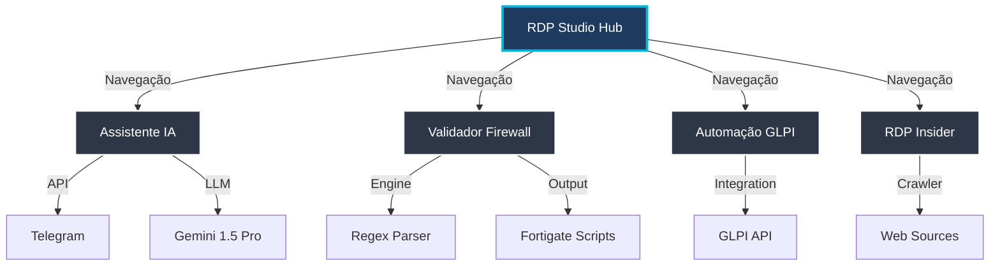

# RDP STUDIO - Enterprise Engineering Hub

<div align="center">

 <!-- Using Client Logo as Placeholder or Text if no main logo -->

**Transformando Complexidade em Solução.**

[](LICENSE)
[](https://marcelordpj.github.io/Tecnoit/)
[](SECURITY.md)
[](https://marcelordpj.github.io/Tecnoit/)

[Explorar Portfólio](https://marcelordpj.github.io/Tecnoit/) • [Ver Documentação](BRANDBOOK.md) • [Reportar Bug](https://github.com/MarceloRDPJ/Tecnoit/issues)

</div>

---

## 🎯 O Que é a RDP Studio?

A **RDP Studio** não é apenas uma consultoria; é um hub de engenharia de alta performance liderado por **Marcelo Rodrigues**. Nossa missão é unir **Infraestrutura Robusta** com **Desenvolvimento Ágil** e **Segurança Ofensiva**.

Este repositório (`Tecnoit`) hospeda o nosso **Hub Central**, uma vitrine tecnológica construída com princípios de **Neuro-Design** e **Arquitetura Estática Serverless**.

### Diferenciais Técnicos
*   **Neuro-Estratégia:** Interfaces projetadas para reduzir a carga cognitiva e guiar a atenção do usuário (Padrões F/Z).
*   **Glassmorphism UI:** Estética ultra-moderna que transmite transparência e tecnologia.
*   **Performance First:** Zero build-steps complexos, carregamento instantâneo via CDN e Tailwind.

---

## 🏗️ Arquitetura do Ecossistema

A plataforma atua como um orquestrador para diversos microsserviços e ferramentas isoladas.



---

## 🚀 Projetos em Destaque

### 🤖 [Assistente de Vendas IA](./projects/assistente-vendas-ia/)
> **Stack:** Python, Gemini 1.5 Pro, Supabase, Telegram API.
Agente autônomo capaz de negociar, verificar estoque e validar pagamentos via PIX lendo comprovantes com Visão Computacional.

### 🛡️ [Validador de Firewall](./projects/validador-firewall/)
> **Stack:** JavaScript, Regex Engine, File API.
Ferramenta de conformidade que sanitiza listas de MAC Address e gera scripts prontos para importação em Firewalls Fortigate.

### ⚙️ [Automação GLPI](./projects/abertura-chamados-glpi/)
> **Stack:** Python, REST API.
Bot de abertura massiva de chamados que varre diretórios locais, identifica evidências e abre tickets com anexos automaticamente.

### 🕵️ [RDP Insider (Geek Blog)](./projects/scanner-game-free/)
> **Stack:** Python Crawler, React, Tailwind.
Plataforma de inteligência e vazamentos de jogos. Cruza dados da web para validar rumores (Hardware/Games) e monitorar ofertas.

---

## 🛠️ Como Executar Localmente

Siga estes passos para ter o ambiente completo rodando em sua máquina:

### Pré-requisitos
*   Git
*   Python 3.x (apenas para servidor local)

### Instalação

1.  **Clone o repositório:**
    ```bash
    git clone https://github.com/MarceloRDPJ/Tecnoit.git
    cd Tecnoit
    ```

2.  **Inicie o Servidor Local:**
    Devido às políticas de CORS dos navegadores modernos, alguns módulos requerem um servidor HTTP.
    ```bash
    # Linux/Mac
    python3 -m http.server 8000

    # Windows
    python -m http.server 8000
    ```

3.  **Acesse:**
    Abra `http://localhost:8000` no seu navegador.

---

## 📚 Documentação & Padrões

Mantemos um rigoroso padrão de qualidade e design.
*   **[BRANDBOOK.md](./BRANDBOOK.md):** Guia de Estilo, Cores e Tipografia.
*   **[SECURITY.md](./SECURITY.md):** Política de Segurança e Report de Vulnerabilidades.
*   **[CHANGELOG.md](./CHANGELOG.md):** Histórico de Versões e Atualizações.

---

## 🤝 Contribuição

Este é um projeto Open Source sob licença MIT. Contribuições são encorajadas!

1.  Faça um **Fork**.
2.  Crie uma branch: `git checkout -b feat/minha-feature`.
3.  Commit suas mudanças: `git commit -m 'feat: adiciona nova funcionalidade'`.
4.  Push: `git push origin feat/minha-feature`.
5.  Abra um **Pull Request**.

---

<div align="center">
  <p>
    <b>© 2025 RDP STUDIO.</b><br>
    <i>Excellence in Engineering.</i>
  </p>
  <p>
    <a href="https://linkedin.com/in/marcelo-rodrigues-088478211">LinkedIn</a> •
    <a href="mailto:contato@rdpstudio.com">Email</a>
  </p>
</div>
